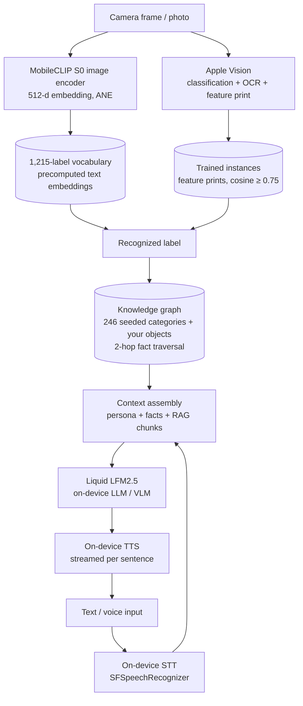

# NativeLiquidChat

**A fully offline multimodal AI agent for iOS — it chats, sees, listens, speaks, and learns your world. No cloud. No account. Not a single network call at runtime.**


Local LFM2/LFM2.5 language & vision models (Liquid AI LEAP SDK) + Apple's on-device perception stack + MobileCLIP zero-shot recognition + a seeded knowledge graph — composed into an agent that runs entirely on the phone.

---

## Highlights

- 💬 **Local LLM chat** — streaming token output, markdown rendering, tokens/sec metric, stop button, multiple sessions with per-session model & system prompt.
- 🖼️ **Vision chat** — attach photos (camera / library); the VL model genuinely *sees* the image. Text-only models receive an Apple-Vision-generated scene description instead.
- 👁️ **Agent Vision (live mode)** — the camera watches the world at 1 Hz; the agent **narrates aloud** what it sees (one crisp sentence, with a Skip button to interrupt), and when it meets a *stable unknown object* it **asks you by voice** what to call it, listens, and **remembers it forever** (visual feature print + knowledge-graph node). Frame analysis pauses while the LLM thinks, so vision and inference never fight for the Neural Engine.
- 🧠 **Zero-shot recognition (MobileCLIP)** — an LLM wrote a 1,215-object vocabulary at build time; MobileCLIP's text encoder turned it into vectors on the Mac; on device only the 22 MB image encoder runs. The agent recognizes over a thousand object types **it was never trained on** — offline.
- 📚 **Implanted world knowledge** — 246 everyday object categories with LLM-synthesized facts, seeded into an on-device knowledge graph (nodes, typed edges, 2-hop traversal). See a mug → hear what mugs are for.
- 🎓 **Instance memory** — teach it *your* mug vs. any mug: `VNGenerateImageFeaturePrintRequest` embeddings, cosine matching, 3-frame averaging, `instance_of` links into the graph.
- 🗣️ **Voice, both ways** — on-device TTS (streamed sentence-by-sentence *while the reply generates*), voice picker with Premium/Enhanced voices, and a **hands-free conversation loop**: listen → recognize (strictly on-device STT) → answer → speak → listen again.
- 📦 **Model manager (LM-Studio style)** — download / activate / delete models with live progress, plus a per-device fit check (RAM & free storage → *Fits / Heavy / Too large / No space*).
- 🔬 **Lab** — LiDAR-assisted object measurements and a Metal compute-shader GPU vs CPU vector-search benchmark.
- 🌐 **RU / EN localization**, dark/light/system themes, offline translation layer, QCA · Ocean reasoning persona preset.
- 🎨 **"Private Intelligence" design system** — graphite surfaces with a single liquid-mint accent, real Liquid Glass surfaces on iOS 26+ (`.glassEffect()` with material fallback), token-driven theming (`DesignSystem.swift`), and SF Symbols with live symbol effects (variableColor while listening, pulse while thinking, breathe on the empty state).

---

## Architecture

The design principle: **the right AI at the right layer.** Deterministic, instant perception at the bottom; generative reasoning only where language is needed.



**Where the LLM participates:** chat replies, seeing photos (VL model), phrasing the agent's spoken narration, synthesizing answers from retrieved facts.
**Where it doesn't:** recognition, instance matching, speech I/O, graph storage — all deterministic and instant.

A deep technical walkthrough lives in [REPORT.md](REPORT.md).

---

## Models

| Model | Size (Q4_0) | Type | Notes |
|---|---|---|---|
| LFM2-350M | ~230 MB | text | tiniest, ultra-fast |
| LFM2-700M | ~450 MB | text | lightweight |
| **LFM2.5-1.2B-Instruct** | ~730 MB | text | **recommended default** |
| LFM2-2.6B | ~1.6 GB | text | highest quality, heavy on 6 GB devices |
| LFM2.5-VL-450M | ~380 MB | vision | compact image understanding |
| **LFM2.5-VL-1.6B** | ~1.1 GB | vision | **recommended for photos** |

Models download on demand inside the app (📦 Models screen) and persist in the app sandbox.

---

## Requirements

- **Xcode 26+** (project generated with [XcodeGen](https://github.com/yonaskolb/XcodeGen)) — older Xcode builds too, but without system Liquid Glass
- **A physical iPhone/iPad (arm64), iOS 18+** — ⚠️ **the Simulator does not work**: the LEAP SDK ships arm64-only slices, so x86_64 Simulators (Intel Macs) cannot build/run it. Build for a device.
- An Apple Developer signing identity (automatic signing is preconfigured — set your own `DEVELOPMENT_TEAM` in `project.yml`).

## Getting started

```bash
git clone https://github.com/trubnikov/NativeLiquidChat.git
cd NativeLiquidChat

# 1. Generate the Xcode project
xcodegen generate

# 2. Open and run on a connected device
open NativeLiquidChat.xcodeproj
```

Or use the helper script (build → install → launch on the configured device):

```bash
./run.sh          # build & run on device
./run.sh test     # run the unit test suite on device
```

First launch: open **📦 Models**, download **LFM Instruct 1.2B**, tap **Activate**, and chat. For the live agent: tap the camera icon → **Agent watches**, grant camera/microphone/speech permissions, and point it at things.

## Testing

17 unit tests cover model serialization, chat storage round-trips, and session management:

```bash
xcodebuild test -project NativeLiquidChat.xcodeproj -scheme NativeLiquidChat \
  -destination 'platform=iOS,id=<your-device-id>' -allowProvisioningUpdates
```

(Tests link the app target, so they also run on a physical device.)

## Project structure

```
Sources/
├── ChatStore.swift            # Central @Observable state: sessions, streaming, speech, agent glue
├── ContentView.swift          # Chat UI: sidebar, messages, input bar, settings
├── AgentVisionView.swift      # Live agent loop: watch → narrate → ask → learn
├── CLIPEngine.swift           # MobileCLIP zero-shot: embed frames, cosine vs vocabulary
├── VisionProcessor.swift      # Apple Vision: classification, OCR, feature prints
├── TrainedObjectsManager.swift# Instance memory (feature prints, cosine matching)
├── TrainingCameraView.swift   # Camera training mode + live classification
├── KnowledgeGraphManager.swift# Graph: nodes/edges, seeded facts, RAG, 2-hop traversal
├── KnowledgeGraphView.swift   # Graph browser & document import
├── ModelCatalog/Manager/View  # LM-Studio-style model library with device-fit checks
├── SpeechManager.swift        # TTS: streaming sentences, voice selection
├── SpeechRecognizer.swift     # Strictly on-device STT with end-of-turn detection
├── PromptPresets.swift        # QCA · Ocean reasoning persona
├── DesignSystem.swift         # Design tokens: colors, radii, glass, symbol effects
├── DepthScanView.swift        # LiDAR 3D: wave field / ARKit mesh / RoomPlan
├── LabView.swift              # LiDAR measurements + Metal GPU benchmark
└── ...
Resources/
├── seed_knowledge.json        # 246 LLM-synthesized object categories with facts
├── clip_vocabulary.txt        # 1,215 object labels (zero-shot vocabulary)
└── clip_vocab_embeddings.bin  # Precomputed MobileCLIP text embeddings (~2.4 MB)
MLModels/
└── mobileclip_s0_image.mlpackage  # MobileCLIP-S0 image encoder (Core ML, 22 MB)
Tests/                         # XCTest unit tests
```

## Privacy

Everything runs on the device: LLM inference, vision, speech recognition (`requiresOnDeviceRecognition = true`), speech synthesis, embeddings, and storage. The only network traffic the app ever produces is downloading model weights you explicitly request. Chats, photos, voice, and learned objects never leave the phone.

## How the "implanted knowledge" works

A recurring methodology in this project: **use the LLM at build time, ship deterministic systems at runtime.**

1. An LLM writes a vocabulary (1,215 object names) and a fact base (246 categories).
2. MobileCLIP's *text* encoder converts the vocabulary into 512-d vectors — on the Mac, once.
3. The app bundles only the *image* encoder and the precomputed vectors.
4. At runtime, recognition is pure geometry (cosine similarity) — no hallucinations, no latency, no network.

The same pattern powers the knowledge graph: facts are synthesized once, traversed deterministically forever.

## Roadmap

- [ ] Foreground segmentation (`VNGenerateForegroundInstanceMaskRequest`) — embed the object, not the background
- [ ] LFM-VL as a "slow lane" in the agent loop — rich scene descriptions on stable frames
- [ ] Optional cloud teacher (opt-in): one-shot naming/facts for objects zero-shot can't resolve
- [x] Liquid Glass UI adoption (system glass + `.glassEffect()` on custom surfaces)

## Acknowledgments

- [Liquid AI](https://www.liquid.ai) — LFM models and the [LEAP SDK](https://leap.liquid.ai)
- [Apple MobileCLIP](https://github.com/apple/ml-mobileclip) — zero-shot image-text embeddings ([Core ML weights](https://huggingface.co/apple/coreml-mobileclip))
- [OpenAI CLIP](https://github.com/openai/CLIP) — BPE tokenizer used at build time

## License

Released under the [MIT License](LICENSE).
